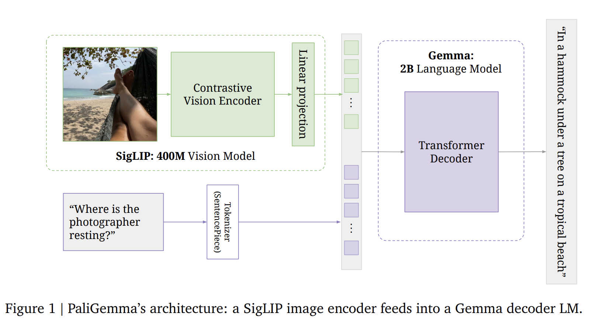

# [PaliGemma: A versatile VLM for transfer](https://arxiv.org/pdf/2407.07726)  
This repo is referenced from the [pytorch-paligemma](https://github.com/hkproj/pytorch-paligemma) by Umar Jamil. Thanks ❤️. 




## Papers 📄  
I am reading these papers:  
✅ [PaLiGemma: A versatile 3B VLM for transfer](https://arxiv.org/pdf/2407.07726)  
✅ [Learning Transferable Visual Models From Natural Language Supervision](https://arxiv.org/pdf/2103.00020)  
✅ [Sigmoid Loss for Language Image Pre-Training](https://arxiv.org/pdf/2303.15343)  
✅ [An Image is Worth 16x16 Words: Transformers for Image Recognition at Scale](https://arxiv.org/abs/2010.11929)  
☑️ [Root Mean Square Layer Normalization](https://arxiv.org/abs/1910.07467)  
✅ [Gemma: Open Models Based on Gemini Research and Technology](https://arxiv.org/pdf/2403.08295)  


## Goals 🎯
☑️ Read and understand the different components of PaLiGemma.  
✅ Understand the concept of Contrastive Learning and use of cross-entropy loss.  
✅ Read and understand the CLIP paper.  
✅ Read and understand the SigLIP paper.  
✅ Read the Vision Transformer paper.  
✅ Review the working mechanism of convolutional neural networks.  
✅ Read about PaLiGemma [tokenizer](https://github.com/google-research/big_vision/blob/main/big_vision/configs/proj/paligemma/README.md#tokenizer).  
☑️ Read HuggingFace's blog on [PaLiGemma](https://huggingface.co/blog/paligemma).  
✅ Read the RMSNorm paper.  
☑️ Read and understand the Gemma paper.  
✅ Review the working mechanism of RoFormer.  
✅ Understand and implement the KVCache.  


## GitHub Repos 📦  
🔗 [CLIP](https://github.com/OpenAI/CLIP)  
🔗 [vision_transformer](https://github.com/google-research/vision_transformer)  


## Citations  
```bibtex
@article{beyer2024paligemma,
    title   = {PaLiGemma: A versatile 3B VLM for transfer},
    author  = {Lucas Beyer, Andreas Steiner, André Susano Pinto, Alexander Kolesnikov, Xiao Wang, Daniel Salz, Maxim Neumann, Ibrahim Alabdulmohsin, Michael Tschannen, Emanuele Bugliarello, Thomas Unterthiner, Daniel Keysers, Skanda Koppula, Fangyu Liu, Adam Grycner, Alexey Gritsenko, Neil Houlsby, Manoj Kumar, Keran Rong, Julian Eisenschlos, Rishabh Kabra, Matthias Bauer, Matko Bošnjak, Xi Chen, Matthias Minderer, Paul Voigtlaender, Ioana Bica, Ivana Balazevic, Joan Puigcerver, Pinelopi Papalampidi, Olivier Henaff, Xi Xiong, Radu Soricut, Jeremiah Harmsen, Xiaohua Zhai},
    year    = 2024,
    eprint  = {2407.07726},
    archivePrefix = {arXiv},
    url     = {https://arxiv.org/abs/2407.07726}
}